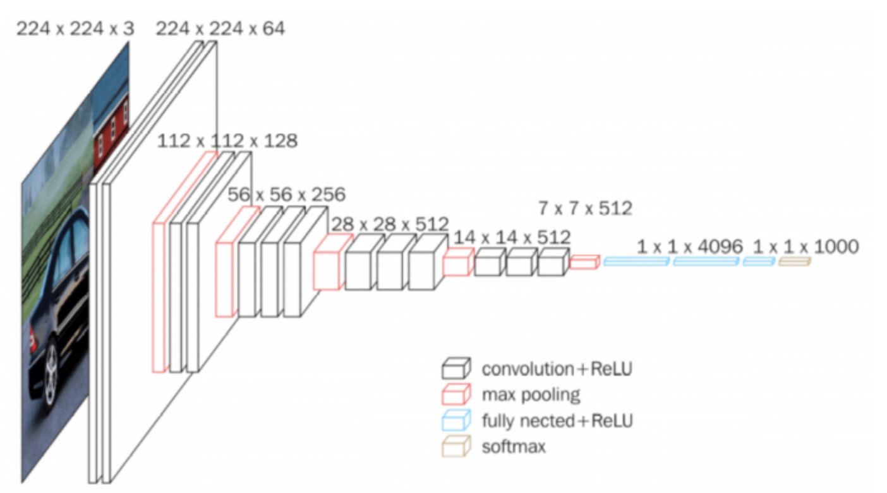
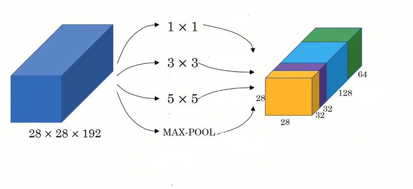
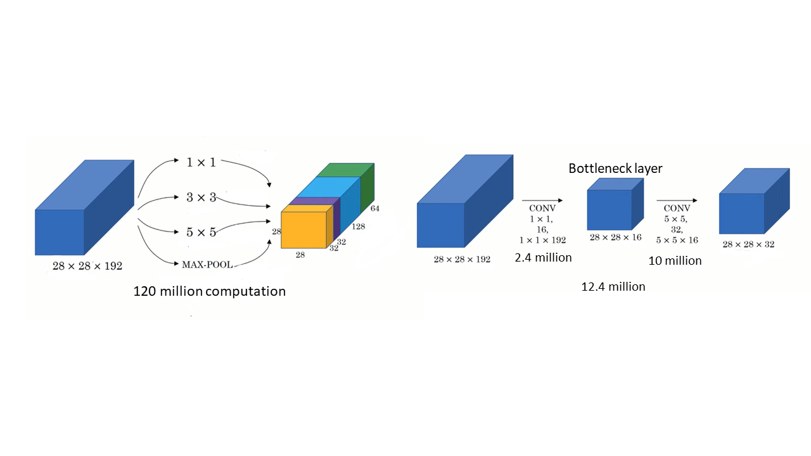
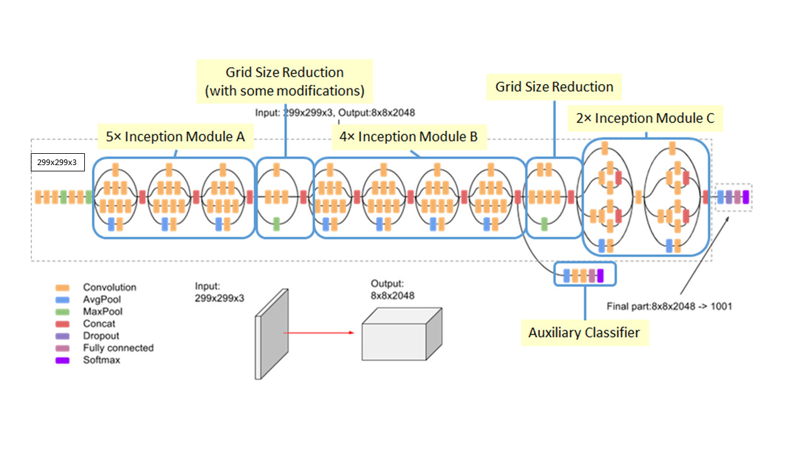

# Sign language interpretation using Deep Learning

## Team Members
- Jayamoorthy, Ajith Kumar
- Srinivasan, Gokul 
- Varatharajan, Akaash
- Venkataramanan, Rohith

## Function of our tool:
Our software aims to translate sign language into English text that would enable easy and efficient communication for aurally impaired people. Communication through sign language will be translated to English in real-time by taking a video stream of sign language as input and classifying
it into textual output using word-level sign recognition. 

## Why we need it and who will benefit from it:
The American Sign Language is one of the most used languages in the United States and is also the fourth- most studied second language in American universities. There are 500,000 ASL users in the US and Canada. In addition to ASL being primarily used by deaf and mute people, ASL is also used by children, siblings, and relatives of deaf people, hearing adults who are becoming
deaf, and a growing population of hearing adults that learn ASL as a second or third language. In addition, ASL improves the quality of family communication for hearing people with deaf and mute relatives.
This Project aims to help reduce the gap between the ASL users and non-ASL users, by helping the non-ASL users learn ASL by practicing it at their own pace. Being an educational tool, everyone that wants to learn ASL would benefit from it.
Furthermore, other applications for this project are:
- Caption generation for Zoom video calls and YouTube sign language content
- Google search using sign language and translations

## Methodology:
The idea is to use a combination of Convolutional Neural Networks (CNN) and Recurrent Neural
Networks (RNN) for video classification. The LSA64 dataset holds both RGB raw video and pre-processed 
video data for over 64 common words, that can be exploited by deep learning algorithms to
learn to classify various hand gestures. CNNs are widely used to recognize and classify images
and are particularly successful at capturing spatial dependencies in an image. On the other hand,
RNNs are adept at learning from sequential and temporal data (e.g., Key points in videos).

The advantages of both these artificial neural networks can be achieved by using the pooling
layer output of CNN as input to the RNN while training. This sequentially passes the convoluted
image features to the RNN, which in turn is expected to make more precise predictions as
compared to a standalone RNN model.
The following steps are proposed to train and test the model:
- Downloading and preprocessing the dataset (Downloading raw videos and extracting
video samples, RGB segmented frames, etc.).
- Splitting dataset into training and testing data
- Training CNN part of the architecture using TensorFlow
- Store predicted results of the pooling layer of the trained CNN for the training data.
- Use the pooling layer of the CNN as input and train the RNN part of the architecture.
- Testing the architecture using the pooling layer predictions of the trained CNN as inputs
for the RNN.

## Motivation for Inception Network 

In general, to extract and store spatial information from an image or video, 2D convolution networks are used. The most common architectures used are ResNet, VGG16 and AlexNet. In these network architectures, only a certain type of filter is used between two layers. 


To avoid this restriction of using just one type of filter or layer between the previous and the next layer, the inception v3 model has been adapted. In the inception network, various types of filters and layers are used between two layers in parallel to combined channel stacked output layers of same size as shown in the figure below: 


Introducing multiple layers increases the computational complexity of the algorithm. In order to tackle this issue, we introduce bottleneck layers. 


It can be observed that with the introduction of the bottle neck layer, the computation cost is about 1/10th of the initial value. Bottleneck do compress the data into much smaller dimensions, but when they are used in the required locations, they can lessen the computational cost without lowering the performance of the algorithm. 


The input feature of the algorithm is of the dimensions 299x299x3.


## GRU Model Creation
The GRU model is imported from `tf-learn` to learn from temporal features as follows:
```bash
def get_network_deep(frames, input_size, num_classes):
    """Create a deep GRU"""
    net = tflearn.input_data(shape=[None, frames, input_size])
    net = tflearn.gru(net, 64, dropout=0.2, return_seq=True)
    net = tflearn.gru(net, 64, dropout=0.2, return_seq=True)
    net = tflearn.gru(net, 64, dropout=0.2)
    net = tflearn.fully_connected(net, num_classes, activation='softmax')
    net = tflearn.regression(net, optimizer='adam',
                             loss='categorical_crossentropy', name="output1")
    return net

```

## Resources used:
- Dataset: [LSA64 - A Dataset for Argentinian Sign Language](https://facundoq.github.io/datasets/lsa64/)
- [TensorFlow](https://www.tensorflow.org/tutorials/images/cnn)
- [Nvidia CUDA 11.2](https://developer.nvidia.com/cuda-11.2.2-download-archive?target_os=Linux&target_arch=x86_64&target_distro=Ubuntu&target_version=2004&target_type=deblocal)
